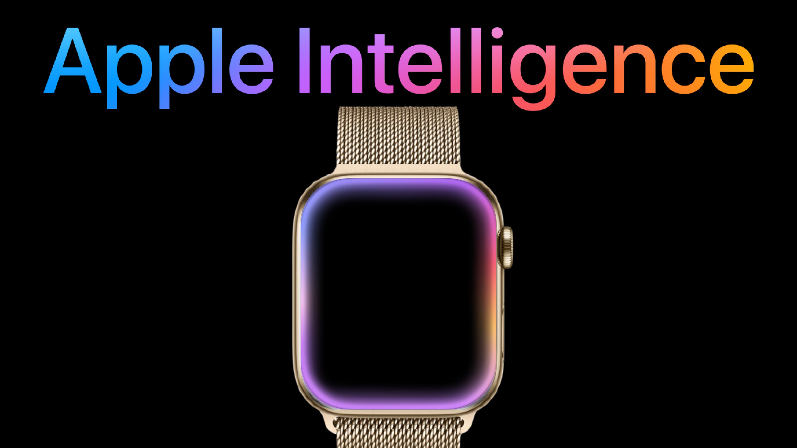

# Animated Apple Inteligence Glow Effect's 
WIP for all Devices.
Made Entirely In SwiftUI with no Metal Shaders.
Animated Device Gif Demos Below

Will be used in [Apple Inteligence For WatchOS](https://github.com/jacobamobin/AppleInteligenceWatchOS)



# Devices
- WatchOS (Complete)
- IOS (Complete)
- IpadOS (Coming Soon)
- MacOS (Coming Soon)

# WatchOS Demo
- WatchOS.Swift is the old version of the animation
- WatchOS_WithFreeze.swift has updated performance and a Freeze (Boolean) parameter to freeze the animation in place


# IOS Demos
- Type to Siri Effect


- Apple Intelligence Glow Effect


# Customization
Customize time interval and animation duration to fine tune the effect
```
Timer.scheduledTimer(withTimeInterval: 0.25, repeats: true) { _ in
      withAnimation(.easeInOut(duration: 0.5)) {
          gradientStops = GlowEffect.generateGradientStops()
      }
  }
```

Customize and fine tune the effect colours
```
static func generateGradientStops() -> [Gradient.Stop] {
        [
            Gradient.Stop(color: Color(hex: "BC82F3"), location: Double.random(in: 0...1)),
            Gradient.Stop(color: Color(hex: "F5B9EA"), location: Double.random(in: 0...1)),
            Gradient.Stop(color: Color(hex: "8D9FFF"), location: Double.random(in: 0...1)),
            Gradient.Stop(color: Color(hex: "AA6EEE"), location: Double.random(in: 0...1)),
            Gradient.Stop(color: Color(hex: "FF6778"), location: Double.random(in: 0...1)),
            Gradient.Stop(color: Color(hex: "FFBA71"), location: Double.random(in: 0...1)),
            Gradient.Stop(color: Color(hex: "C686FF"), location: Double.random(in: 0...1))
        ].sorted { $0.location < $1.location }
    }
```

Customize each individual layer's thickness and blur strength.
Using the width and blur properties.
```
ZStack {
  EffectNoBlur(gradientStops: gradientStops, width: 5)
      .onAppear {
          // Start a timer to update the gradient stops every second
          Timer.scheduledTimer(withTimeInterval: 0.25, repeats: true) { _ in
              withAnimation(.easeInOut(duration: 0.5)) {
                  gradientStops = GlowEffect.generateGradientStops()
              }
          }
      }
  Effect(gradientStops: gradientStops, width: 7, blur: 4)
      .onAppear {
          // Start a timer to update the gradient stops every second
          Timer.scheduledTimer(withTimeInterval: 0.3, repeats: true) { _ in
              withAnimation(.easeInOut(duration: 0.6)) {
                  gradientStops = GlowEffect.generateGradientStops()
              }
          }
      }
  }
```

# How to Use 
- Copy the [OSName].swift into your project.
- Call it from another view 

Open to new pull requests, Please give the repo a star if this was any help to you
